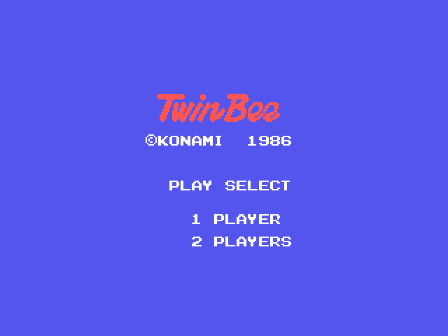
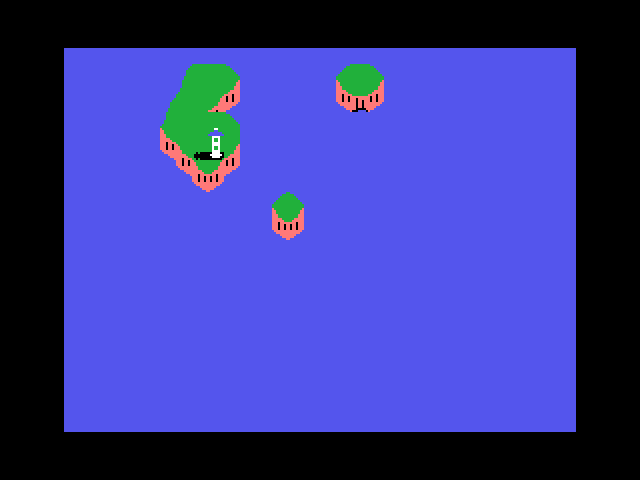
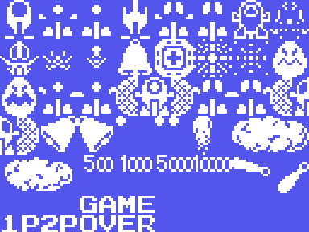
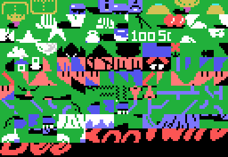
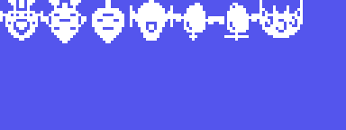
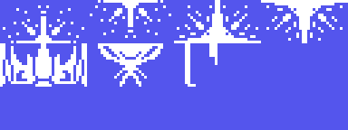

# The game

*Twin Bee* is a vertical shoot'em up Konami published for the MSX in 1986,
catalogue number **RC-740**, on a 32 KB cartridge. Two little ships with arms
fly over an island, shoot at clouds and collect the bells that fall out of
them.

## What a game looks like

You control a ship that moves in all four directions and fires upwards. Two
buttons: one shoots, the other drops a bomb on the ground. Two players can
play at once, each with their own ship, their own score and their own lives.

The stage number climbs one at a time to **99**, but there are only **five**
sceneries: `(0xE076)` holds which one is showing, and when its low nibble
reaches six it goes back to `0x11` -the first one again, with the high nibble
counting laps. Reaching stage 99 is the only way to finish the game.

## The bells

Shoot a cloud and a bell falls out. While it falls it keeps changing colour,
and the game lets you keep it in the air by shooting it: that is the whole
mechanic. What it gives, though, does **not** come from the colour you see. It
comes from a 32-step counter that advances one place every time a bell is
collected, and only **five** of those thirty-two slots carry a prize:

| slot | prize |
|---|---|
| 4 | one more power level, up to seven |
| 8 | the twin shot |
| 16 | the arm |
| 20 | the weapon, sixteen uses |
| 32 | the shield |

The other twenty-seven only give points. That table is not even in the ROM:
`empieza_la_partida` writes it into RAM by hand with five `ld` and four
`rlca`.

## The arm

The ship can stretch an arm upwards. It is `nace_el_disparo_uno` (`0x65F1`)
that drives it: the arm appears at the top of the screen, waits, and then
climbs three pixels a frame until its counter runs out.

## Two ships that hold hands

This is the part almost no two-player game of the period had. If the two ships
get close enough -`mira_si_se_dan_la_mano` (`0x667C`) measures the distance on
both axes and asks for both to fit inside 0x22 pixels- they **latch together**
and from then on `mueve_las_dos_agarradas` (`0x6326`) moves them as one.

While they are joined, the input that counts is the sum of both joysticks, and
`0x5EC7` zeroes it the moment one of the two pulls the other way: that is what
pulls them apart. And the drawing of the arm that joins them is not improvised
either - it comes out of an 81-value table, nine steps of vertical distance by
nine of horizontal.

## The scenery

The scenery is **a single strip of 1,761 rows**, built out of 248 blocks of 32
tiles —one whole screen row each—, and the five stages run through it **back
to back**: stage 1 goes from row 0 to row 261, where its boss arrives; stage 2
carries on from there to 585; stage 3 to 945; stage 4 to 1272, and stage 5 to
1760, the end of the strip (the table at `0x6132`). When a boss falls, `0x613C`
uploads the next scenery's tiles without moving the screen. What changes from
stage to stage is the artwork; what does *not* repeat is the terrain: each
stage has its own.

And while playing, VDP register 7 holds `0xE0`: the border and every
transparent tile are **black**, not the title's blue. The maps here are drawn
that way, which is how they look.

It scrolls one row every sixteen frames -`avanza_el_decorado` (`0x6CD1`) is
what counts them- and the map is stored **bottom to top**: the row at the top
of the screen is the higher index, and the counter climbs as the game goes on.

## The enemies

Fourteen slots of 0x20 bytes each, from `0xE160`. Byte 1 of a slot says what
that enemy **is**: that number indexes the forty-pointer table at `0xAD60` and
out comes the routine that moves it. Five of those forty do double duty as the
boss's shots.

With two players, the enemies do not aim at the nearest ship or the most
annoying one: they take turns. `elige_a_quien_apuntar` (`0xBA72`) flips
`(0xE150)` with an `xor 1` on every call, so one enemy aims at the first ship
and the next one at the second.

## The bosses

One per stage, in its own slot at `0xE320`, with its behaviour taken from the
five-pointer table at `0xADCC`. A boss does not fit in a 16x16 sprite, so it is
drawn by **writing tiles** into the screen buffer: `coloca_al_jefe` (`0xBBC9`)
takes its tile script and places two tiles on one row and two on the row below.

## The demo

Leave the cartridge alone and it plays by itself. It is not an AI: it is a
**recorded game**. Twenty-eight joystick readings, one every 32 frames, fed in
through the very same door the player's input uses. And so the same string of
presses gives the same game every time, the Z80's R register -which is where
this cartridge gets its randomness- is set to zero before starting.
